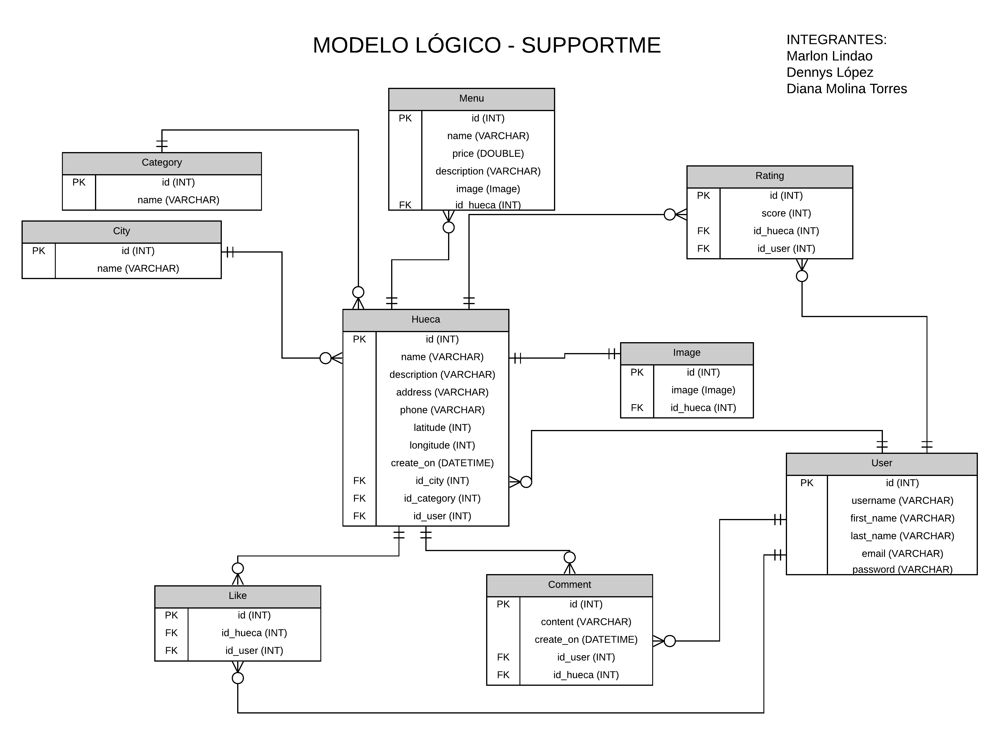
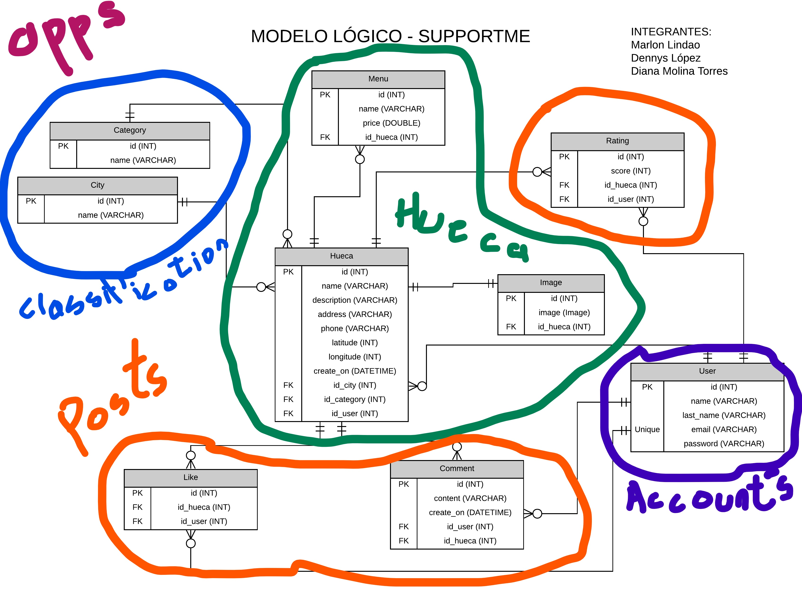

# Flutter App
[Supportme-app](https://github.com/lopdam/supportme-app)
# DB Model


# Django Apps


## Install VirtualEnv

```
virtualenv env
```

## Activate VirtualEnv
```
.\env\Scripts\activate
```

## Install Requirements VirtualEnv
```
pip install -r requirements.txt
```